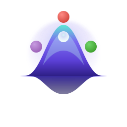

<div align="center">



# GaussianFermions.jl

**Fermionic Gaussian states under unitary, Lindblad, and monitored dynamics.**

From number-conserving free fermions to general quadratic / Majorana / BdG states.

[](https://jayren3996.github.io/GaussianFermions.jl/) [](https://github.com/jayren3996/GaussianFermions.jl/actions/workflows/CI.yml) [](LICENSE) [](https://julialang.org)

</div>

---

GaussianFermions.jl simulates finite fermionic Gaussian systems under quadratic Hamiltonian
dynamics, Gaussian Lindblad dynamics, and monitored trajectory updates. It is written for
researchers who already know the physics and want a precise Julia interface with explicit,
documented conventions.

## ✨ Features

|  |  |
| --- | --- |
| 🧩 **Three state representations** | `SlaterState`, `CorrelationState`, and `MajoranaState` cover pure, mixed `U(1)`-symmetric, and general (paired) Gaussian states. |
| 🌀 **Closed & open dynamics** | Unitary `QuadraticHamiltonian` / `BdGHamiltonian` evolution, plus deterministic `CorrelationLindblad` and `MajoranaLindblad` solvers. |
| 🎲 **Monitored trajectories** | Low-level measurement, quantum-jump, and weak-measurement primitives. There is no hidden ensemble runner; you own the sampling loop. |
| ⚛️ **Pairing / BdG** | Bogoliubov ground and thermal states, anomalous correlators, and number-non-conserving baths via raw Majorana jump vectors. |
| 📐 **Explicit conventions** | Fixed correlator and covariance conventions, verified against exact diagonalization. |
| 🎯 **Finite-system focus** | Dense solvers built for precise finite-size calculations. |

## 📦 Installation

```julia
pkg> add https://github.com/jayren3996/GaussianFermions.jl
```

## 🚀 Quick Start

Evolve a half-filled free-fermion chain under a hopping Hamiltonian and read off the density:

```julia
using GaussianFermions

L = 8
H = hopping(L; pbc=true)
state = CorrelationState(SlaterState(L=L, N=L ÷ 2, config="Z2"))

evolve!(state, H, 0.5)
round.(density(state); digits=3)
```

## 🧭 Choosing a Representation

| Modeling need | Use |
| --- | --- |
| Pure fixed-particle states | `SlaterState` |
| Mixed `U(1)`-symmetric states | `CorrelationState` |
| Pairing, BdG dynamics, anomalous correlators | `MajoranaState` |
| Number-conserving quadratic Hamiltonians | `QuadraticHamiltonian` |
| BdG Hamiltonians with pairing | `BdGHamiltonian` |
| Deterministic `U(1)` open dynamics | `CorrelationLindblad` |
| Deterministic BdG open dynamics | `MajoranaLindblad` |
| Monitored trajectories | compose the low-level primitives in your loop |

The last row is intentional. GaussianFermions.jl does not hide trajectory sampling behind an
ensemble runner. You evolve a state, draw measurements or jumps, update the state, and
accumulate the observables your calculation needs.

## 🛠 Usage

<details>
<summary><b>Deterministic correlation-matrix Lindblad dynamics</b></summary>

<br>

Number-conserving open dynamics on the single-particle correlation matrix.

```julia
using GaussianFermions

L = 16
H = hopping(L; pbc=true)

loss1 = zeros(ComplexF64, L)
loss1[1] = sqrt(0.2)

lind = CorrelationLindblad(H; loss_ops=[loss1])
state = CorrelationState(SlaterState(L=L, N=8, config="Z2"))

evolve!(state, lind, 1.0)
density(state)
```

Low-level `loss_ops` and `gain_ops` are Lindblad amplitude vectors: for rate γ on normalized
mode `v`, pass `sqrt(γ) * v`. The current deterministic solver is dense and intended for finite
systems.

For finite systems with a unique attractive state, solve directly:

```julia
steady = steadystate(CorrelationLindblad(zeros(ComplexF64, 1, 1);
                                        loss_ops=[ComplexF64[sqrt(0.6)]],
                                        gain_ops=[ComplexF64[sqrt(0.2)]]))
density(steady)  # ≈ [0.25]
```

</details>

<details>
<summary><b>Majorana / BdG foundation</b></summary>

<br>

General quadratic (BdG/Majorana) Gaussian states use `MajoranaState`, which stores the real
antisymmetric Majorana covariance matrix. `BdGHamiltonian` evolves this covariance under dense
unitary dynamics.

```julia
using GaussianFermions

state = MajoranaState([1, 0, 1, 0])
A = zeros(ComplexF64, 4, 4)
B = zeros(ComplexF64, 4, 4)
B[1, 2] = 0.3
B[2, 1] = -0.3

H = BdGHamiltonian(A, B)
evolve!(state, H, 0.5)

normal_correlation(state)
anomalous_correlation(state)
```

Correlations follow the standard convention `Cᵢⱼ = ⟨c⁺ᵢcⱼ⟩`, `Fᵢⱼ = ⟨cᵢcⱼ⟩` with covariance
`Γ_ab = (i/2)⟨[ωₐ,ω_b]⟩` (verified against exact diagonalization). Ground and thermal states of a
`BdGHamiltonian` come from Bogoliubov/Nambu diagonalization:

```julia
H = BdGHamiltonian(A, B)
gs = groundstate(H)              # BCS ground state as a MajoranaState
ε  = quasiparticle_energies(H)   # Bogoliubov spectrum (≥ 0)
ρβ = thermalstate(H; β=2.0)      # Gibbs state; β → ∞ recovers groundstate(H)
```

Open-system BdG dynamics use `MajoranaLindblad`, the covariance-matrix analogue of
`CorrelationLindblad`. It supports particle loss/gain, occupation dephasing, and — unlike the
number-conserving solver — general pairing (number-non-conserving) baths via raw Majorana jump
vectors.

```julia
using GaussianFermions

H = hopping(4; pbc=true)
lind = MajoranaLindblad(H; loss_ops=[sqrt(0.3) * ComplexF64[1, 0, 0, 0]],
                        dephasing_ops=[(ComplexF64[1, 1, 0, 0] / sqrt(2), 0.5)])

state = MajoranaState(CorrelationState(SlaterState(L=4, N=2, config="Z2")))
evolve!(state, lind, 1.0)
density(state)

normal_correlation(state)
anomalous_correlation(state)   # nonzero once a pairing bath acts
```

On number-conserving channels `MajoranaLindblad` reproduces `CorrelationLindblad` to machine
precision (see `example/Dephase.jl`).

</details>

### 🎲 Quantum trajectories

Monitored dynamics are built from **low-level primitives**. There is no trajectory runner: you
own the loop. Evolve a step, decide measurements or jumps, accumulate observables. This keeps the
dynamics explicit and tunable per script. The primitives (for both `SlaterState` and
`MajoranaState`):

- Projective occupation measurement (Born statistics, collapse): `measure!(s::MajoranaState, i)`
  measures site `i`; `measure!(qm::QuasiMode, s::SlaterState)` measures a quasi-mode of a
  `SlaterState`.
- `jump_rate(s, ℓ)` / `apply_click!(s, ℓ)` / `apply_noclick!(s, jumps, dt)`: linear quantum-jump
  (MCWF) building blocks. For `SlaterState` the channel forms are `jump_rate(ch, s, dt)` /
  `apply_click!(ch, s, work)` / `apply_noclick!(ch, s, dt)`.
- `weak_measure!(s, i, α)`: the exact weak-measurement filter `exp(α nᵢ)` for continuous
  (quantum-state-diffusion) monitoring.

<details>
<summary><b>Projective monitoring + trajectory average</b></summary>

<br>

Projective monitoring of a `MajoranaState` with a hand-rolled trajectory average:

```julia
using GaussianFermions, Random

H = BdGHamiltonian(QuadraticHamiltonian(Matrix(hopping(8; pbc=true).h)))
U = propagator(H, 0.05)
rng = Xoshiro(1); ntraj = 200; ΣS = 0.0
for _ in 1:ntraj
    s = MajoranaState(CorrelationState(SlaterState(L=8, N=4, config="Z2")))
    for _ in 1:40
        evolve!(s, U)
        for i in 1:8
            rand(rng) < 0.5 * 0.05 && measure!(s, i; rng)   # monitor each site at rate 0.5
        end
    end
    global ΣS += entanglement_entropy(s, 1:4)
end
ΣS / ntraj   # trajectory-averaged half-chain entanglement
```

Projective measurement of `nᵢ` at rate `γ` averages to the dephasing Lindblad `D[√(2γ) nᵢ]`, so
the trajectory average reproduces `MajoranaLindblad`.

</details>

<details>
<summary><b>Dissipative loss / gain / pairing jumps (MCWF)</b></summary>

<br>

A Monte-Carlo wave-function (MCWF) step draws a click (the conditional Gaussian state) or applies
the effective non-Hermitian no-click drift. `loss_jump` / `gain_jump` / `majorana_jump` build the
Majorana jump vector `ℓ`; pairing jumps generate anomalous correlations:

```julia
using GaussianFermions, Random

U = propagator(BdGHamiltonian(QuadraticHamiltonian(Matrix(hopping(4; pbc=true).h))), 0.01)
jumps = [loss_jump(sqrt(0.4) * ComplexF64[1, 0, 0, 0]),
         gain_jump(sqrt(0.25) * ComplexF64[0, 0, 1, 0])]
rng = Xoshiro(1)
s = MajoranaState(CorrelationState(SlaterState(L=4, N=2, config="Z2")))
for _ in 1:150
    evolve!(s, U)
    rates = [jump_rate(s, ℓ) for ℓ in jumps]
    if rand(rng) < sum(rates) * 0.01
        apply_click!(s, jumps[argmax(rand(rng) .< cumsum(rates) ./ sum(rates))])
    else
        apply_noclick!(s, jumps, 0.01)
    end
end
density(s)   # averaged over trajectories, matches MajoranaLindblad(H; loss_ops=…, gain_ops=…)
```

</details>

<details>
<summary><b>Continuous (QSD) monitoring</b></summary>

<br>

Continuous (QSD) monitoring applies the exact weak filter `exp(αᵢ nᵢ)` with
`αᵢ = δWᵢ + (2⟨nᵢ⟩ − 1)γᵢ dt`:

```julia
using GaussianFermions, Random

U = propagator(BdGHamiltonian(QuadraticHamiltonian(Matrix(hopping(4; pbc=true).h))), 0.01)
rng = Xoshiro(1); γ = 0.7
s = MajoranaState(CorrelationState(SlaterState(L=4, N=2, config="Z2")))
for _ in 1:100
    evolve!(s, U)
    for i in 1:4
        α = randn(rng) * sqrt(γ * 0.01) + (2 * density(s, i) - 1) * γ * 0.01
        weak_measure!(s, i, α)
    end
end
density(s)
```

The `MajoranaState` `weak_measure!` matches the number-conserving `SlaterState` one to machine
precision, and averaging over the noise reproduces the dephasing Lindblad `D[√γ nᵢ]` (verified
against the `SlaterState` filter and exact diagonalization, including paired states).

</details>

## 📚 Documentation

Full documentation lives at **[jayren3996.github.io/GaussianFermions.jl](https://jayren3996.github.io/GaussianFermions.jl/)**.

- [Conventions](https://jayren3996.github.io/GaussianFermions.jl/manual/conventions/) — read before comparing signs or correlations with another codebase.
- [States](https://jayren3996.github.io/GaussianFermions.jl/manual/states/) and [Hamiltonians & Time Evolution](https://jayren3996.github.io/GaussianFermions.jl/manual/hamiltonians/) — model a closed system.
- [Lindblad Dynamics](https://jayren3996.github.io/GaussianFermions.jl/manual/lindblad/) — deterministic open-system evolution.
- [Quantum Trajectories](https://jayren3996.github.io/GaussianFermions.jl/manual/trajectories/) — monitored dynamics.
- [API Reference](https://jayren3996.github.io/GaussianFermions.jl/reference/overview/) — signatures and mutation behavior.

## 🗂 Examples

Complete, runnable scripts live in [`example/`](example/):

- [`FreeFermion.jl`](example/FreeFermion.jl) — free-fermion evolution and a full trajectory loop.
- [`MI.jl`](example/MI.jl) — monitored mutual information.
- [`Dephase.jl`](example/Dephase.jl) — dephasing as a trajectory average versus the Lindblad solver.
- [`Transition.jl`](example/Transition.jl) — measurement-induced entanglement transition (`⟨S⟩` vs monitoring rate).
- [`Protocols.jl`](example/Protocols.jl) — projective / MCWF / QSD unravelings of occupation monitoring.

Worked, narrated versions of these (and more) are in the [documentation examples](https://jayren3996.github.io/GaussianFermions.jl/examples/free-fermion-chain/), including the [measurement-induced transition](https://jayren3996.github.io/GaussianFermions.jl/examples/measurement-induced-transition/) and [monitoring-protocol comparison](https://jayren3996.github.io/GaussianFermions.jl/examples/monitoring-protocols/).

## 📄 License

[MIT](LICENSE) © 2023 JieRen and contributors.
